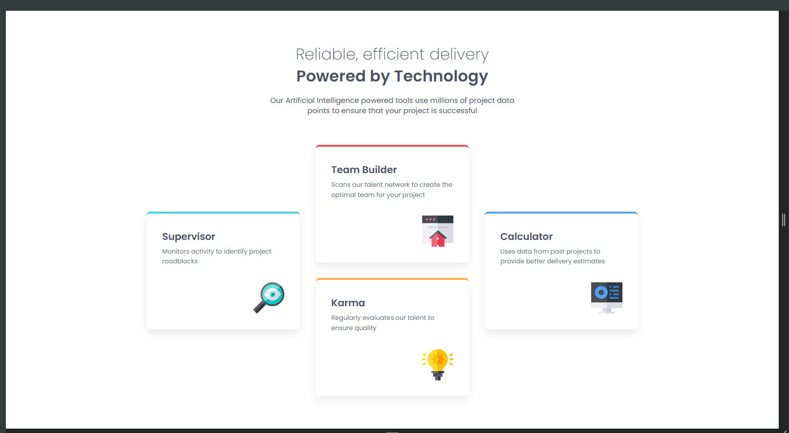
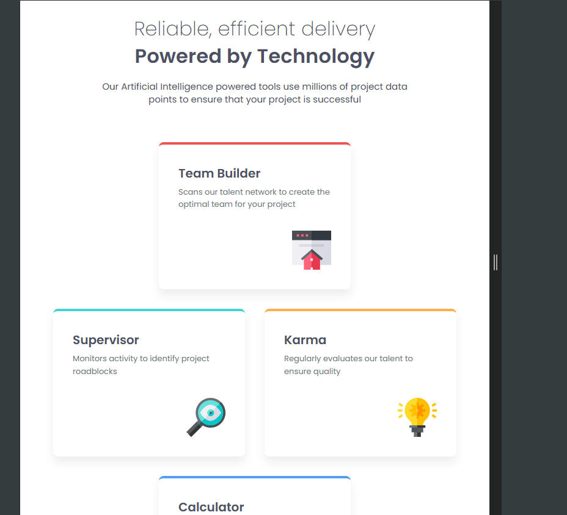
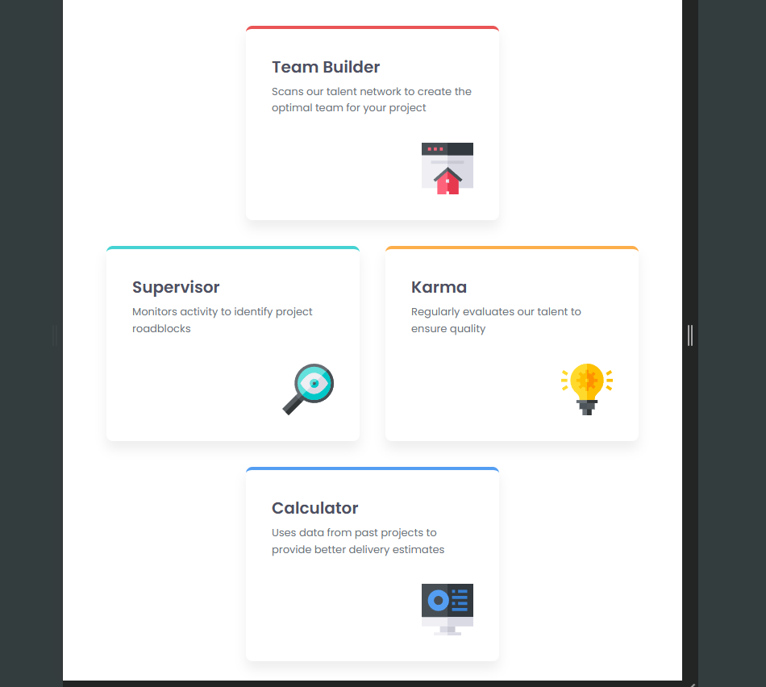
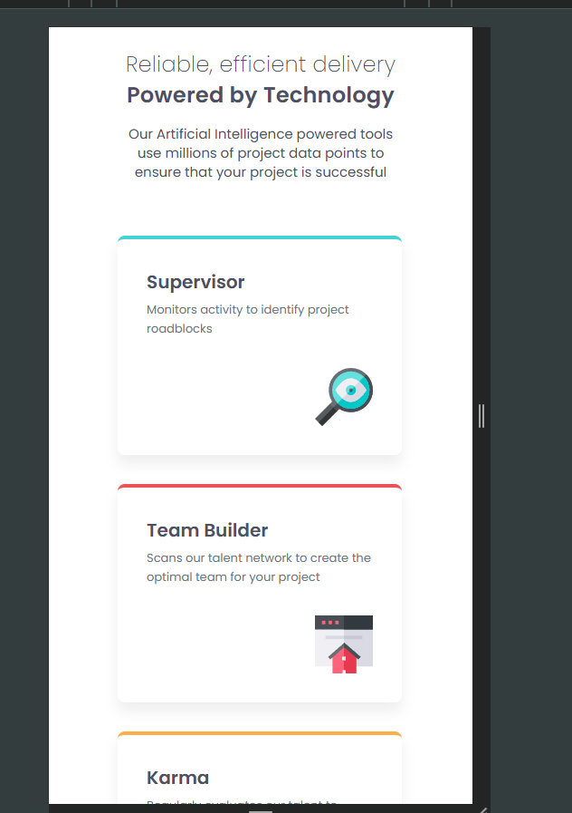
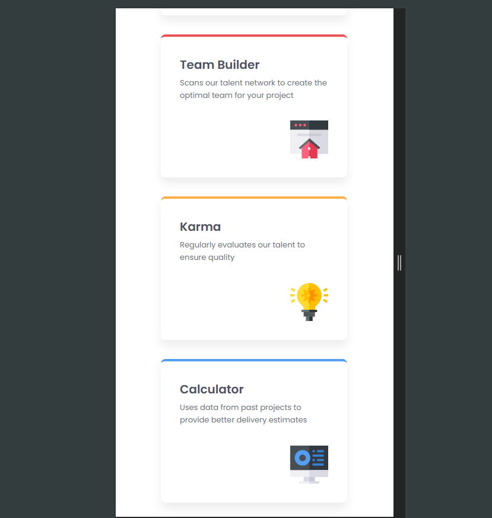

# Frontend Mentor - Four card feature section - solução

Essa é uma solução para o desafio [Four card feature section](https://www.frontendmentor.io/challenges/four-card-feature-section-weK1eFYK). Os desafios do Frontend Mentor nos ajuda a melhorar a nossa habilidade com o desenvolvimento front-end.

## Conteúdos

### Versões do projeto
- Desktop

  
- Tablet

- Mobile

##
### Links
- Repositório: [solução](https://github.com/jose-wolf/four-card-feature-section)
- Site URL: [site do desafio](https://fourcardfeaturesectionproject.netlify.app/)

### O que eu aprendi?
- Css grid
- Responsividade.
- Controle de tamanho e alinhamento.

O objetivo é utilizar cada vez mais o css grid, para que possa aprende-lo melhor.

## Author

- LinkedIn - [José Wolf](https://www.linkedin.com/in/jose-wolf)
- Frontend Mentor - [@jose-wolf](https://www.frontendmentor.io/profile/jose-wolf)
